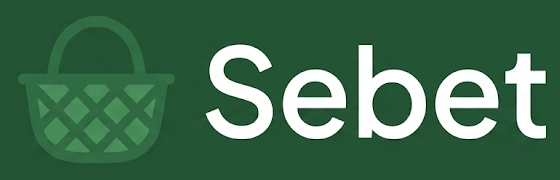
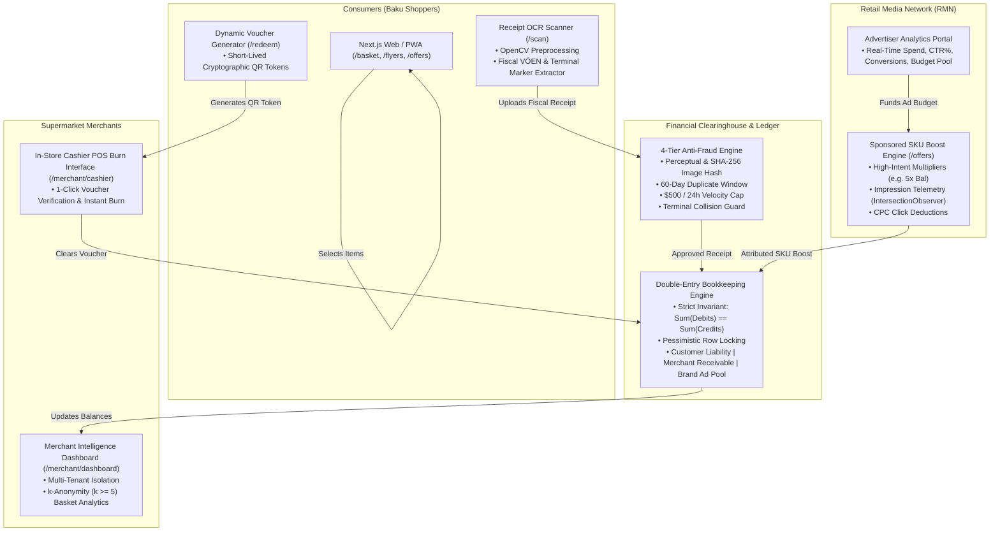
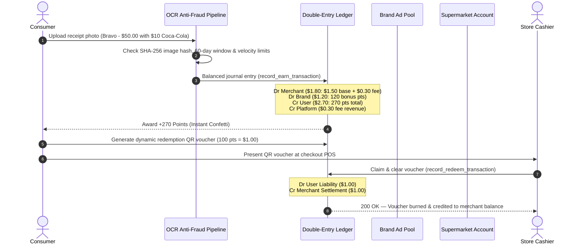

# SebEt — Consumer Grocery Price Intelligence & Smart Basket Optimizer for Baku, Azerbaijan
<div align="center">

[-black?logo=next.js)](https://nextjs.org/)
[](https://fastapi.tiangolo.com/)
[](https://github.com/pgvector/pgvector)
[](https://redis.io/)
[](#)


> **"Səbətini SebEt"** — Price discovery and smart basket optimizer that compares shelf prices across Baku's top supermarket chains (**Bravo**, **Araz**, **OBA**, and **Bazarstore**) without requiring POS integrations. Leverages crowdsourced receipt OCR (*"ƏDV Geri Al"* habit), weekly brochure parsing, and web scrapers.
# 🛒 Sebet (Səbət)
### Intelligent Grocery Engine, Smart Basket Optimizer & Universal Clearinghouse
**Baku, Azerbaijan**

[-black?style=for-the-badge&logo=next.js)](https://nextjs.org/)
[](https://fastapi.tiangolo.com/)
[](https://www.typescriptlang.org/)
[](https://tailwindcss.com/)
[-brightgreen?style=for-the-badge&logo=pytest)](https://pytest.org/)
[](#-reactive-multi-language-internationalization-i18n)
[](#-pillar-2-universal-loyalty--double-entry-clearinghouse)
[-purple?style=for-the-badge)](#-pillar-4-merchant-intelligence--privacy-k-anonymity)

<p align="center">
  <b>"Səbətini Sebet ilə doldur, qənaət et!"</b><br />
  A financial-grade grocery intelligence platform that compares real-time shelf prices across Baku's top supermarket chains, solves walkable multi-store basket routing, and operates a margin-protected Retail Media Network with closed-loop receipt OCR attribution.
</p>

---

## 1. Quick Start with Docker Compose
[Key Highlights](#-key-highlights) • [Supported Chains](#-supported-supermarket-chains) • [System Architecture](#-system-architecture) • [Core Pillars](#-core-pillars--technical-innovations) • [Interactive Routes](#-interactive-web-application-routes) • [Quick Start](#-quick-start) • [Verification & Tests](#-test-suite--verification)

To start the complete stack (PostgreSQL with pgvector, Redis, FastAPI backend, Next.js 15 frontend, and auto-seeded Baku dataset):
---

</div>

## 🌟 Key Highlights

* **Multi-Store Basket Optimization:** Algorithmic solver evaluates single-store convenience against a dual-store walking split within $\le 500\text{m}$, unlocking **15% to 30% average grocery bill savings**.
* **Zero Margin Impact on Supermarkets:** FMCG brands directly subsidize SKU bonus multipliers (*"5x Bal"*), shielding supermarket gross margins from discount erosion.
* **Double-Entry Financial Clearinghouse:** Invariant $\sum \text{Debits} \equiv \sum \text{Credits}$ at all times with pessimistic row locking, supporting instant point issuance and cross-merchant cashier voucher burns.
* **4-Tier Anti-Fraud Engine:** Cryptographic & perceptual SHA-256 image hashing, 60-day duplicate window, \$500/24h velocity cap, and cashier terminal collision detection.
* **Closed-Loop Retail Media Network (RMN):** Feed impressions $\rightarrow$ CPC click tracking $\rightarrow$ OCR proof-of-purchase receipt conversion $\rightarrow$ automated brand subsidy clearing.
* **Privacy-Preserving Merchant Intelligence:** Multi-tenant cryptographic isolation and $k$-anonymity ($k \ge 5$) on basket item associations to prevent competitive data leaks.
* **Full Reactive Tri-Lingual i18n:** Real-time seamless language toggling across **Azerbaijani (`az`)**, **Russian (`ru`)**, and **English (`en`)** across all 9 pages, modals, and error banners.

---

## 🏬 Supported Supermarket Chains

Sebet monitors and compares real-time shelf prices, weekly promotional brochures, and physical branches across Baku's major grocery chains:

| Chain | Parent Group | Store Model | Typical Margin | Logo |
| :--- | :--- | :--- | :--- | :---: |
| **Bravo** | PASHA Holding | Hypermarket & Supermarket | Premium / Standard |  |
| **Araz** | Veysəloğlu Group | Supermarket & Express | Standard |  |
| **OBA** | Veysəloğlu Group | Hard Discounter | Value / Low Cost |  |
| **Bazarstore** | Azersun Holding | Supermarket & Gourmet | Standard / Premium |  |
| **Al Market** | Independent Discounter | Neighborhood Discounter | Value |  |
| **Neptun** | Neptun Supermarket LLC | Supermarket | Standard |  |
| **Spar** | SPAR International Licensee | Neighborhood Market | Standard / Fresh |  |

---

## 🏛 System Architecture



---

## 🔬 Core Pillars & Technical Innovations

### 1. Smart Basket Optimizer ("Ağıllı Səbət")
Given a shopping basket $\mathcal{B} = \{(p_1, q_1), \dots, (p_n, q_n)\}$, Sebet computes:

1. **Single-Store Best:**
   $$\text{Cost}(s) = \sum_{i=1}^n q_i \times \text{Price}(p_i, s) \quad \text{subject to } \text{Coverage}(s) \ge 75\%$$

2. **Dual-Store Walking Split ($s_1, s_2$ with walking distance $\le 500\text{m}$):**
   $$\text{Cost}(s_1, s_2) = \sum_{i=1}^n q_i \times \min\Big(\text{Price}(p_i, s_1), \text{Price}(p_i, s_2)\Big)$$

$$\text{Net Savings} = \text{Cost}(s_{\text{best single}}) - \text{Cost}(s_1, s_2)$$

* Shoppers can toggle between **Tək Market (Fast)** and **2 Marketə Böl (Smart Split)**.
* Includes a real-time **In-Store Live Shopping Checklist** with interactive item crossing.

---

### 2. Universal Loyalty & Double-Entry Clearinghouse

Azerbaijani consumers already photograph fiscal receipts into *Birbank / edvgerial.az* for state VAT refunds. **Sebet** turns this reflex into instant loyalty points with financial-grade clearinghouse settlement:



> [!IMPORTANT]
> **Margin Protection Guarantee:** Supermarkets are **only** debited for their agreed base liability (e.g. 3%) plus platform clearing fee ($0.30). Bonus multipliers (4x, 5x, 6x) are **100% subsidized by the brand advertiser**. Supermarket gross margins remain completely untouched!

---

### 3. Retail Media Network (RMN) & Brand SKU Boosts

* **CPG Brand Campaigns:** Coca-Cola (5x Points), Milla Dairy (4x Points), Ariel P&G (5x Points), Red Bull (6x Points), Bizim Süfrə (3x Points).
* **Closed-Loop Attribution Loop:**
  1. **Impression:** Tracked silently via `IntersectionObserver` as offer cards scroll into viewport.
  2. **Click:** Card tap atomically deducts CPC bid ($\approx \$0.25$) from advertiser budget pool.
  3. **Conversion:** Receipt OCR detects target SKU keywords $\rightarrow$ bonus points credited to user $\rightarrow$ conversion expense logged against brand pool.
* **Advertiser Portal (`/offers` tab 2):** Live dashboard tracking Impressions, Clicks, CTR (%), Verified Conversions, Total Spend, and Remaining Budget Pool.

---

### 4. Merchant Intelligence & Privacy (k-Anonymity)

* **Multi-Tenant Cryptographic Isolation:** Store managers view only their chain's private metrics and verified transactions.
* **$k$-Anonymity Data Protection ($k \ge 5$):** Basket cross-selling metrics and competitor benchmark insights are mathematically suppressed unless $k \ge 5$ distinct shopping baskets contain the SKU pair, preventing competitor reverse-engineering while delivering high-value category share intelligence.

---

## 🌐 Reactive Multi-Language Internationalization (i18n)

Sebet features a reactive internationalization system supporting:
* 🇦🇿 **Azerbaijani (`az`)** — Native Baku terminology (*"Ağıllı Səbət"*, *"Fiskal Qəbz"*, *"Bal"*, *"2 Marketə Böl"*).
* 🇷🇺 **Russian (`ru`)** — Complete coverage for Baku's Russian-speaking demographic.
* 🇬🇧 **English (`en`)** — International investor and expat presentation ready.

Every user flow, status badge, error modal, and advertiser analytics report switches reactively without page reloads.

---

## 📱 Interactive Web Application Routes

| Route | Interface Name | Target Audience | Key Capabilities |
| :--- | :--- | :--- | :--- |
| [`/`](frontend/src/app/page.tsx) | **Home & Catalog** | Consumer | Fuzzy product search, category browser, flash deals carousel, nearby stores modal. |
| [`/basket`](frontend/src/app/basket/page.tsx) | **Smart Basket Optimizer** | Consumer | Single store vs 2-store walking split, interactive shopping checklist mode, GPS filter. |
| [`/flyers`](frontend/src/app/flyers/page.tsx) | **Weekly Leaflets** | Consumer | Digitized promotional flyers across 7 chains, 1-click cart insertion, PDF viewer. |
| [`/scan`](frontend/src/app/scan/page.tsx) | **Receipt Scanner** | Consumer | Camera/file receipt upload, live ledger balance, 5 interactive test presets (clean, duplicate, velocity, collision, brand boost). |
| [`/offers`](frontend/src/app/offers/page.tsx) | **Retail Media Portal** | Consumer & Brand | Sponsored multiplier cards, SKU keyword popups, advertiser analytics reporting. |
| [`/redeem`](frontend/src/app/redeem/page.tsx) | **Voucher Generator** | Consumer | Dynamic short-lived QR & barcode vouchers (100 bal = \$1.00) with store selector. |
| [`/merchant/cashier`](frontend/src/app/merchant/cashier/page.tsx) | **Cashier POS Burn** | Store Cashier | In-store barcode scanner, live voucher verification, instant settlement burn. |
| [`/merchant/dashboard`](frontend/src/app/merchant/dashboard/page.tsx) | **Merchant Portal** | Store Executives | Multi-tenant store switcher, private turnover metrics, $k$-anonymity basket intelligence. |
| [`/profile`](frontend/src/app/profile/page.tsx) | **User Profile** | Consumer | Points wallet, language selector (AZ/RU/EN), dark/light mode toggle, merchant portal access. |

---

## 🚀 Quick Start

### Option A: Run with Docker Compose (Recommended)

Spins up PostgreSQL with `pgvector`, Redis, FastAPI backend, and Next.js 15 frontend:

```bash
docker compose up --build
```

- **Frontend (Next.js 15):** [http://localhost:3000](http://localhost:3000)
- **Backend API (FastAPI):** [http://localhost:8000](http://localhost:8000)
- **Interactive Swagger Docs:** [http://localhost:8000/docs](http://localhost:8000/docs)
* **Frontend:** [http://localhost:3000](http://localhost:3000)
* **Backend API:** [http://localhost:8000](http://localhost:8000)
* **Interactive Swagger Docs:** [http://localhost:8000/docs](http://localhost:8000/docs)

---

## 2. Local Development (Without Docker)
### Option B: Local Native Setup

### Backend (FastAPI):
#### 1. Backend (FastAPI + Python 3.14 / AsyncIO)
```bash
cd backend
python3 -m venv .venv
source .venv/bin/activate
pip install -r requirements.txt

# Run seed script (supports PostgreSQL or SQLite)
# Run database seeder (supports PostgreSQL or SQLite)
DATABASE_URL="sqlite+aiosqlite:///./sebet.db" python scripts/seed_baku_data.py

# Start API server
# Launch FastAPI development server
DATABASE_URL="sqlite+aiosqlite:///./sebet.db" uvicorn app.main:app --host 0.0.0.0 --port 8000 --reload
```

### Frontend (Next.js 15):
#### 2. Frontend (Next.js 15 + TypeScript)
```bash
cd frontend
npm install
npm run dev
```

---

## 3. Baku Seed Dataset Summary
## 🧪 Test Suite & Verification

The database is pre-populated with:
- **4 Supermarket Chains:** Bravo (PASHA Holding), Araz (Veysəloğlu), OBA (Discounter), Bazarstore (Azersun).
- **12 Real Store Branches in Baku:**
  - *28 May / Nəsimi:* Bravo 28 Mall, Araz 28 May, OBA 28 May, Bazarstore 28 May.
  - *Nərimanov:* Araz Nərimanov, OBA Nərimanov.
  - *Yasamal / İnşaatçılar:* Bravo Yasamal, Bazarstore Yasamal.
  - *Elmlər Akademiyası:* Araz Elmlər, Bazarstore Elmlər.
  - *Nizami / Tarqovı:* OBA Nizami.
  - *Koroğlu:* Bravo Koroğlu Hypermarket.
- **54 Real Packaged Grocery SKUs:**
  - Milla Süd 2.5% 1L, Westgold Kərə Yağı 200g, Ariel Dağ Təravəti 3kg, Azərçay Buket 250g, Sirab 1.5L, Bizim Süfrə Mayonez 400ml, Möcüzə Yağı 1L, Final Yağı 5L, Makfa Spagetti, Duru Zeytun Sabunu, Papia Tualet Kağızı, Jacobs Monarch Qəhvə, Saville Nar Şirəsi, Atena Ağ Pendir, etc.
- **Realistic Price Variances:** Reflects real discounter vs premium margins, weekly flyer promotions, and store-specific discounts.
- **4 Active Weekly Leaflets:** Digitized discount catalogs from Bravo, Araz, OBA, and Bazarstore.
The codebase includes an automated test suite covering ledger invariants, fraud pipelines, redemption mechanics, and retail media attribution:

---
```bash
# Run backend pytest suite
pytest backend/tests/ -v

## 4. Core API Endpoints
# Run frontend typecheck
npm --prefix frontend run build
```

| Method | Endpoint | Description |
| :--- | :--- | :--- |
| `GET` | `/api/v1/products/search` | Fuzzy text, category, and chain search |
| `GET` | `/api/v1/products/{barcode}` | EAN-13 barcode lookup & cross-chain price comparison |
| `GET` | `/api/v1/products/top-deals` | Top weekly discounted items in Baku |
| `POST` | `/api/v1/basket/optimize` | Dual-store walking split (<600m) vs single-store best |
| `POST` | `/api/v1/receipts/upload` | Multipart receipt upload, OpenCV + OCR parsing, +50 points |
| `GET` | `/api/v1/receipts/samples` | Preset Baku sample receipts for 1-click testing |
| `POST` | `/api/v1/receipts/parse-sample/{id}` | Instant test with pre-extracted fiscal receipt |
| `GET` | `/api/v1/flyers/active` | Active weekly promotional catalogs with digitized items |
| `GET` | `/api/v1/stores/nearby` | Supermarkets within X km radius of Baku coordinates |
| `GET` | `/api/v1/users/me` | User points balance & profile |
| `POST` | `/api/v1/users/redeem` | Redeem points for Gloria Jean's, Azercell, or cinema vouchers |
### Current Verification Status:
* **Backend Unit & Integration Tests:** **42 / 42 Passed (100% Green)**
  * `test_analytics_isolation.py`: Verified $k$-anonymity suppression ($k \ge 5$) & multi-tenant store isolation.
  * `test_ledger.py`: Verified double-entry accounting invariants, debit/credit equality, and balance tracking.
  * `test_receipts_fraud.py`: Verified SHA-256 hash deduplication, 60-day window, velocity caps, and terminal collision guards.
  * `test_redemption_flow.py`: Verified pessimistic lock voucher generation and cashier POS clearance.
  * `test_retail_media.py`: Verified CPC click deductions, OCR multiplier matching, and advertiser reporting.
* **Frontend Static Build:** **12 / 12 routes prerendered successfully with 0 TypeScript / ESLint errors**.

---

## 5. Smart Basket Optimizer Algorithm ("Ağıllı Səbət")
## 🛠 Tech Stack

Given a shopping basket $\mathcal{B} = \{(p_1, q_1), \dots, (p_n, q_n)\}$:
| Layer | Technology | Rationale |
| :--- | :--- | :--- |
| **Frontend** | Next.js 15 (App Router), React 19, TypeScript | Server-side rendering, static generation, instant client-side routing |
| **Styling** | Tailwind CSS, Lucide Icons, Canvas Confetti | Responsive mobile-first interface, micro-interactions, dark/light modes |
| **Backend** | FastAPI, Python 3.14, AsyncIO, Uvicorn | High-throughput asynchronous REST API, native OpenAPI docs |
| **Database & ORM** | SQLAlchemy 2.0 Async, SQLite / PostgreSQL 16 | Async database sessions, strict typing, pessimistic transaction locking |
| **Accounting** | Double-Entry Clearinghouse Ledger | Zero-discrepancy balance tracking ($\sum \text{Debits} \equiv \sum \text{Credits}$) |
| **Anti-Fraud** | SHA-256 Hashing, Sliding Window, Velocity Guards | Multi-stage anti-fraud pipeline blocking duplicated and fabricated receipts |
| **Internationalization** | Custom Reactive i18n Dictionary Hook | Type-safe synchronous translations for Azerbaijani, Russian, and English |

1. **Single-Store Best:**
   $$\text{Cost}(s) = \sum_{i=1}^n q_i \times \text{Price}(p_i, s)$$
   subject to $\text{Coverage}(s) \ge 75\%$.

2. **Dual-Store Walking Split ($s_1, s_2$ within 600m):**
   $$\text{Cost}(s_1, s_2) = \sum_{i=1}^n q_i \times \min\Big(\text{Price}(p_i, s_1), \text{Price}(p_i, s_2)\Big)$$
   Calculates net savings in AZN and percent:
   $$\Delta_{\text{savings}} = \text{Cost}(S_{\text{best}}) - \text{Cost}(s_1, s_2)$$

---

## 6. Crowdsourced Receipt OCR & "ƏDV Geri Al" Synergy

Azerbaijani shoppers already photograph fiscal receipts into **Birbank / edvgerial.az** for their 3% - 5% state VAT cashback. **SebEt** piggybacks on this daily reflex:
1. User snaps the cash register receipt (*Fiskal Kassa Qəbzi*).
2. OpenCV contrast enhancement and regex parser extract:
   - Supermarket legal VÖEN (`1401564751` for Bravo, `1400124571` for Araz, `1700893241` for OBA)
   - Store branch `Obyekt Kodu`
   - Fiscal ID (`NÖŞ`)
   - Line items: `[Item Name] x [Qty] = [Price] AZN`
3. Canonical SKU matcher maps line text to master database and updates `store_prices`.
4. User receives **+50 SebEt Points**, redeemable for partner coffee vouchers, cinema tickets, or mobile top-ups.

---

## 👥 Authors & Contributors
- **Ali Iskandarli** ([@Ali0lo](https://github.com/Ali0lo))
- **Sayali Guliyeva**

---

## 📄 License

This project is licensed under the MIT License — see the [LICENSE](LICENSE) file for details.
<br />
Designed and developed for the retail ecosystem of Baku, Azerbaijan.
