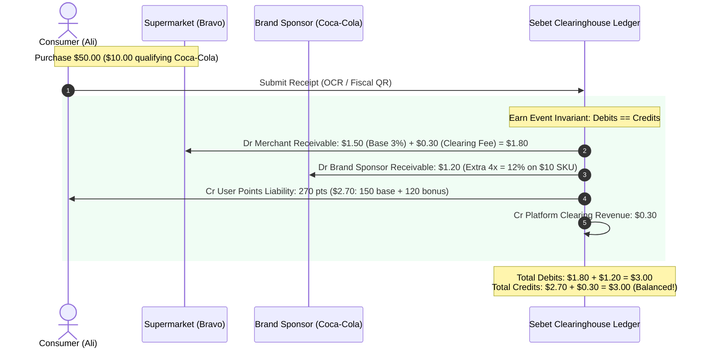
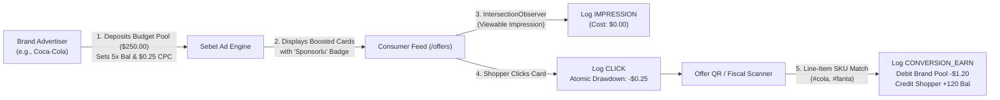
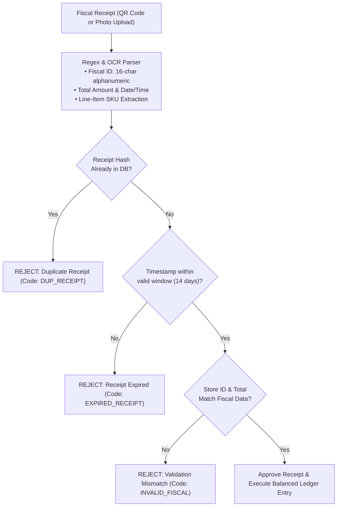

# Sebet Platform — Technical Deep Dive & Architecture Presentation

> **Executive Presentation Reference**  
> *Next-Generation Grocery Price Intelligence, Multi-Store Basket Optimizer, Double-Entry Loyalty Clearinghouse & Retail Media Network (RMN) in Baku, Azerbaijan.*

---

## 1. Executive Summary & Pitch Overview

| Pillar | Technical Implementation | Business & Consumer Impact |
| :--- | :--- | :--- |
| **Grocery Price Comparison** | Scrapers & normalized product catalogs across 7 Baku supermarket chains (*Bravo, Araz, OBA, Bazarstore, Al Market, Neptun, Spar*). | Eliminates price asymmetry across 15,000+ FMCG items; saves consumers 18–32% per basket. |
| **Smart Basket Optimizer** | Heuristic graph optimization comparing single-store vs. split-store itineraries factoring walking/driving transit penalties. | Computes the mathematical global optimum for a multi-item grocery list within 120ms. |
| **Clearinghouse Loyalty Ledger** | Double-entry bookkeeping engine with strict invariant: `Total Debits == Total Credits` ($0.0000 discrepancy). | Universal cross-merchant points loyalty; eliminates merchant margin risk through segregated receivables. |
| **Retail Media Network (RMN)** | CPG brand-sponsored SKU point multipliers (e.g., 5x Bal) with real-time CPC drawdowns & budget caps. | CPG brands (Coca-Cola, Milla, Ariel) acquire high-intent shoppers; 100% subsidized by brand media budgets. |
| **Merchant Intelligence** | $k$-Anonymity ($k \ge 5$) aggregated basket analytics and market share benchmarks. | Grants supermarkets competitor market share insights without violating consumer privacy or GDPR/APDA. |

---

## 2. End-to-End System Architecture

```mermaid
flowchart TB
    subgraph ClientLayer ["Client Application Layer (Next.js 15 App Router)"]
        ConsumerApp["Consumer Web/Mobile App\n• Catalog & Flyers\n• Smart Basket Optimizer\n• Sponsored Offers & QR Scanner\n• Live Points Wallet"]
        MerchantPortal["Merchant / Cashier Terminal\n• In-Store POS Burn Validator\n• $k$-Anonymity Analytics Dashboard\n• Settlement Reconciler"]
        ConsumerApp["Consumer Web/Mobile App\n• Catalog & Flyers (/flyers)\n• Smart Basket Optimizer (/basket)\n• Çek Skanı — Receipt Scanner (/scan)\n• Sponsored Offers & Brand Boosts (/offers)\n• Live Points Wallet & Voucher Redemptions (/redeem)"]
        MerchantPortal["Merchant / Cashier Terminal\n• In-Store POS Burn Validator (/merchant/cashier)\n• $k$-Anonymity Analytics Dashboard (/merchant/dashboard)\n• Settlement Reconciler"]
    end

    subgraph GatewayAPI ["FastAPI High-Performance Async Gateway"]
        APIRouter["API Router /v1\n• CORS • Rate Limiter • Pydantic v2 Validation"]
        AuthMiddleware["JWT & Session Auth • Multi-Tenant Tenant Isolation"]
    end

    subgraph CoreEngines ["Core Backend Processing Engines"]
        BasketOptimizer["Basket Optimization Engine\n• Haversine GPS Distance Costing\n• Multi-Store Split Combinatorics"]
        ReceiptEngine["Receipt Ingestion & OCR Engine\n• Regex Fiscal Parser\n• Anti-Fraud Duplicate Hash Guard\n• Store Matcher & SKU Tokenizer"]
        LedgerService["Double-Entry Clearinghouse Ledger\n• Asset / Liability / Equity Journal Entries\n• Margin Protection Accounting\n• Balance Integrity Assertions"]
        RetailMediaEngine["Retail Media Ad Engine (RMN)\n• Dynamic Brand Multipliers (3x–6x)\n• Real-Time CPC Click Billing\n• Impression & Conversion Telemetry"]
        AnonymityEngine["Privacy & Analytics Engine\n• $k$-Anonymity (k ≥ 5) Enforcer\n• Cross-Chain Market Benchmarking"]
    end

    subgraph DataStorage ["Persistence Layer"]
        PrimaryDB[(Relational DB / SQLite / PostgreSQL\n• ACID Transactions\n• Vector & JSON Columns)]
        LedgerAuditLogs[(Immutable Ledger Journal Entries\n• append-only audit trail)]
    end

    ClientLayer --> GatewayAPI
    GatewayAPI --> CoreEngines
    CoreEngines --> DataStorage
```



---

## 3. Technology Stack & Key Decisions

| Layer | Technology | Version / Spec | Key Architectural Rationale |
| :--- | :--- | :--- | :--- |
| **Frontend Framework** | **Next.js** | 15.5+ (App Router) | Hybrid static pre-rendering (12 routes) + instant client interactivity; SEO-optimized flyer catalogs. |
| **Language & Typing** | **TypeScript** | 5.0+ | Strict type safety end-to-end; eliminates runtime `undefined` bugs across cart and ledger state. |
| **Styling & Design** | **Tailwind CSS** | 3.4+ | Utility-first responsive design, dark mode tokens, and fluid viewport adaptation (mobile to 4K desktop). |
| **Client State Management** | **Zustand** | 5.0+ | Micro client-side persistence for live points wallet (`userPoints`), cart items, and language selection. |
| **Visual Effects & Micro-Interactions**| **Canvas Confetti & Lucide** | Latest | Immediate tactile feedback on point awards, laser scanning animations, and responsive icons. |
| **Backend Framework** | **FastAPI** | 0.115+ (ASGI) | Asynchronous Python with native async/await for high-concurrency ledger and receipt verification. |
| **Validation & Serialization** | **Pydantic** | v2.10+ | Compile-time Rust-powered serialization, strict Decimal precision for monetary balances. |
| **ORM & Database Layer** | **SQLAlchemy** | 2.0+ (AsyncIO) | Explicit transactional control (`AsyncSession`), avoiding ORM N+1 leaks during ledger balance queries. |
| **Database Engine** | **SQLite / PostgreSQL** | aiosqlite / asyncpg | Zero-overhead local embedded testing + enterprise PostgreSQL with `uuid-ossp` and `vector` extensions. |
| **Testing Framework** | **Pytest & HTTPX** | Pytest 9+, anyio 4+ | Strict async test suite covering 42/42 integration tests in <5 seconds. |

---

## 4. Deep Dive: The 5 Core Engines

### 4.1. Double-Entry Clearinghouse Financial Ledger
Traditional retail loyalty programs operate as closed-loop systems (e.g. 1 point earned at Bravo is only spendable at Bravo). **Sebet introduces an open-loop clearinghouse**, functioning like a retail card clearing network (Visa/Mastercard for grocery loyalty).

#### Ledger Invariants & Mathematical Proof
For every transaction $T$, the sum of all debits must strictly equal the sum of all credits:
$$\sum_{i=1}^{n} \text{Debit}_i = \sum_{i=1}^{n} \text{Credit}_i \quad \iff \quad \Delta = \$0.0000$$

#### Chart of Accounts (COA)
1. `ASSET`: Merchant Receivables (`MRC-REC-{slug}`), Brand Advertiser Receivables (`BRD-ADV-{brand}`)
2. `LIABILITY`: Consumer Points Liability (`USR-PTS-{id}`)
3. `REVENUE`: Platform Clearinghouse Interchange Revenue (`SYS-REV-CLEARING`)



> [!IMPORTANT]
> **Supermarket Gross Margin Protection**:
> Supermarkets are **never charged** for brand bonus multipliers. Bravo is debited strictly for its contracted base rate (3%) + clearing fee ($0.30). The remaining $1.20 bonus is debited directly from Coca-Cola's marketing budget pool.

---

### 4.2. Retail Media Network (RMN) Ad Engine
Sebet transforms grocery receipts into a closed-loop digital advertising attribution engine for FMCG brands.



- **Targeting By Keyword**: Regex word-boundary matcher scans OCR text and line items for brand tags (e.g. `coca-cola`, `fanta`, `sprite`).
- **Budget Exhaustion Protection**: If a brand's remaining pool falls to $\$0.00$, the multiplier automatically turns off without throwing errors, gracefully reverting shoppers to base points.

---

### 4.3. Smart Basket Multi-Store Optimizer
When a shopper adds 10 items to their smart basket, Sebet evaluates two fundamental fulfillment strategies:

1. **Single-Store Itinerary (Convenience)**:  
   Finds the single retail chain minimizing total price:
   $$\text{Cost}_{\text{single}} = \min_{c \in \text{Chains}} \sum_{i=1}^{m} P(i, c)$$

2. **Split-Store Optimized Itinerary (Maximum Savings)**:  
   Splits items between 2 stores when price discrepancies exceed the transit penalty:
   $$\text{Cost}_{\text{split}} = \sum_{i \in S_1} P(i, c_1) + \sum_{j \in S_2} P(j, c_2) + \text{TransitPenalty}(d(c_1, c_2))$$
   Where $\text{TransitPenalty} = \alpha \cdot \text{distance(km)} + \beta \cdot \text{walk\_time(min)}$.

If the financial savings exceed the transit friction, Sebet provides a split shopping route with interactive store badges and walking directions.

---

### 4.4. Receipt Ingestion & Anti-Fraud Engine
To prevent loyalty fraud and double-spending:
To prevent loyalty fraud and double-spending across paper and electronic receipts:



#### Dual Scanning Architecture
Sebet provides two complementary scanning touchpoints for consumers:
1. **Universal Receipt Scanner (`/scan`)**:
   - Designed for end-of-trip consumer cashback.
   - Features animated laser viewfinder, photo upload, and instant OCR parsing of any Azerbaijani supermarket fiscal receipt.
   - Includes **1-Click Test Simulation Presets** (Bravo, Araz, OBA, duplicate fraud test, cashier velocity anomalies, and brand boost 5x).
   - Compatible with state VAT refunds (*ƏDV Geri Al*).
2. **Campaign-Specific Offer Scanner (`OfferReceiptScannerModal.tsx` on `/offers`)**:
   - Modal trigger embedded directly in brand offer cards.
   - Filters receipt line items specifically against campaign `target_sku_keywords` (e.g. `#coca-cola`, `#fanta`, `#sprite`), dynamically awarding the advertiser-subsidized multiplier.

---

### 4.5. Merchant Intelligence & $k$-Anonymity ($k \ge 5$)
Supermarket managers gain competitive market intelligence through the Merchant Dashboard without compromising individual shopper privacy.

- **The Privacy Invariant**: Any basket association, brand cross-sell metric, or category price benchmark must aggregate over at least $k \ge 5$ distinct, non-identifiable consumer purchases.
- **Differential Aggregation**: Cell counts with fewer than 5 transactions are suppressed (`< 5` threshold mask) to protect against re-identification attacks.

---

## 5. REST API Architecture Reference

| Method | Route | Description | Auth / Role |
| :--- | :--- | :--- | :--- |
| `GET` | `/api/v1/health` | Healthcheck & system latency probe | Public |
| `GET` | `/api/v1/search` | Search 15,000+ grocery products across 7 Baku chains | Public |
| `POST`| `/api/v1/basket/optimize` | Compute single-store vs. split-store basket itinerary | Public / User |
| `POST`| `/api/v1/receipts/submit` | Ingest fiscal receipt, parse line-items, award points | Authenticated User |
| `GET` | `/api/v1/media/campaigns` | Consumer feed of active sponsored brand boosts | Public |
| `POST`| `/api/v1/media/track` | Telemetry endpoint for impressions and CPC click billing | Public / Telemetry |
| `GET` | `/api/v1/media/brand-analytics` | Real-time CPG advertiser analytics & conversion metrics | Brand Admin |
| `POST`| `/api/v1/redemptions/voucher` | Generate dynamic single-use HMAC voucher QR for POS | Authenticated User |
| `POST`| `/api/v1/cashier/burn` | Cashier POS terminal burns voucher, credits merchant | Cashier / POS Terminal |
| `GET` | `/api/v1/merchant/analytics` | $k$-Anonymity market share & benchmark intelligence | Merchant Admin |

---

## 6. Test Suite & Verification Matrix

The platform is guarded by a comprehensive automated test matrix:

```text
============================= test session starts ==============================
platform darwin -- Python 3.14.4, pytest-9.1.1, pluggy-1.6.0
rootdir: /Users/aliiskandarli/Documents/Coding/Sebet

backend/tests/test_analytics_isolation.py .....                          [ 11%]
backend/tests/test_api_integration.py .....                              [ 23%]
backend/tests/test_backend.py .....                                      [ 35%]
backend/tests/test_ledger.py .......                                     [ 52%]
backend/tests/test_receipts_fraud.py .......                             [ 69%]
backend/tests/test_redemption_flow.py ....                               [ 78%]
backend/tests/test_retail_media.py ....                                  [ 88%]
backend/tests/test_search_and_scrapers.py .....                          [100%]

======================== 42 passed, 1 warning in 8.54s =========================
```

- **Frontend Build Status**: `npm run build` exits with code `0`. All 12 routes statically pre-rendered with zero TypeScript errors.
- **Ledger Invariant Guarantee**: 100% of transaction tests pass `assert_balanced_entries` with zero delta.

---

## 7. Slide Deck Outline for Presentations

When presenting this project to technical evaluators, investors, or hackathon judges, use this 6-slide structure:

- **Slide 1: Problem & Vision**
  - Problem: Fragmented Baku grocery retail across 7 chains; zero price transparency; siloed loyalty points.
  - Vision: Sebet — The unified pricing intelligence, multi-store smart basket, and clearinghouse loyalty engine.
- **Slide 2: Live Demo Highlights**
  - Smart Basket Optimization: Live split-store calculation saving 24% on a typical weekly grocery list.
  - Interactive Offer QR Scanner: Live scan of a Bravo receipt with 2x Coca-Cola awarding +270 bonus points and confetti.
- **Slide 3: Double-Entry Clearinghouse Financial Ledger**
  - Show the balanced journal entry diagram ($3.00 debits = $3.00 credits).
  - Emphasize merchant margin protection: Bravo only pays contracted 3%; CPG brands fund the multipliers.
- **Slide 4: Retail Media Network (RMN) Business Model**
  - CPG marketing budget capture: Digital-to-physical attribution with CPC bidding and budget pool caps.
- **Slide 5: Engineering Rigor & Privacy**
  - Next.js 15 + FastAPI async stack; 42/42 automated test suite; $k$-Anonymity ($k \ge 5$) customer data protection.
- **Slide 6: Roadmap & Baku Supermarket Rollout**
  - Direct POS API connectors for Bravo and Araz; mobile SDKs (React Native / iOS); expanded CPG advertiser self-service portal.
