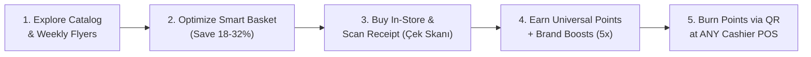

# Sebet — What This Project Does
> **Executive Overview & Presentation Narrative**  
> *The Intelligent Grocery Shopping Companion, Universal Loyalty Clearinghouse, and Retail Media Network for Azerbaijan.*

---

## 1. The 30-Second Elevator Pitch

**Sebet** is a unified grocery pricing intelligence and loyalty platform that solves the three biggest headaches in Baku's supermarket ecosystem:

1. **For Shoppers**: Compares prices across 7 supermarket chains (*Bravo, Araz, OBA, Bazarstore, Al Market, Neptun, Spar*), optimizes grocery baskets for up to **32% savings**, and turns paper/electronic receipts into universal cashback loyalty points through **Çek Skanı**.
2. **For Supermarkets**: Drives incremental foot traffic and larger baskets without squeezing retail gross margins.
3. **For FMCG Brands (Coca-Cola, Milla, Ariel, P&G)**: Provides a closed-loop **Retail Media Network (RMN)** where brands sponsor high-intent point multipliers (e.g., **5x Bal**) directly attributed to actual store purchases.

---

## 2. The Problem in Baku's Grocery Market

```
   [FRAGMENTED CHAINS]              [CLOSED-LOOP POINTS]              [BLIND BRAND ADVERTISING]
  7 major retail chains;         Each store has a separate card     Brands spend millions on TV &
Prices for the same butter,     (Umico, SuperKart, etc.). Points    billboards with zero measurement
milk, or coffee vary by 35%.     cannot be spent across stores.      of actual in-store purchases.
```

- **Price Asymmetry**: Grocery inflation is a major consumer challenge. A weekly shopping list can cost 80 ₼ at one chain and 55 ₼ at another, but consumers lack the time to inspect physical brochures.
- **Siloed Loyalty Cards**: Shoppers are forced to juggle multiple apps and plastic cards. Points earned at Store A can never be spent at Store B.
- **Zero In-Store Attribution**: CPG brands have no direct channel to incentivize supermarket shoppers at the shelf level and measure verified return on ad spend (ROAS).

---

## 3. The Solution: What Sebet Does (Feature by Feature)



### Feature 1: Cross-Chain Price Comparison & Weekly Flyers
- Aggregates 15,000+ FMCG products across 7 supermarket chains in Baku.
- Interactive digital flyer reader (*Həftəlik Endirim Bukletləri*) allows consumers to flip through weekly discounts and add promotional items directly to their cart with one tap.
- Filter by supermarket brand, category (*Süd, Qida, Məişət, İçkilər*), or search by item name with autocomplete.

### Feature 2: Smart Basket Optimizer (Single vs. Split Store)
When a user adds their grocery list to the cart, Sebet runs a heuristic optimization algorithm:
- **Single-Store Itinerary**: Identifies the single supermarket chain offering the lowest total receipt total for convenience.
- **Split-Store Optimized Itinerary**: If dividing the basket between two nearby stores saves significant money (e.g., buying dairy at Araz and detergents at Bravo), Sebet computes the split route, calculates walking/driving transit friction, and displays exact net savings.

### Feature 3: Çek Skanı — Receipt Scanner & Instant Cashback
- Shoppers simply photograph their paper receipt or scan the fiscal QR code.
- **Optical Character Recognition (OCR)** parses the fiscal ID, supermarket VÖEN, purchase timestamp, and individual line items.
- **Anti-Fraud Security**: Detects and rejects duplicate receipts, altered amounts, or expired receipts (>14 days).
- **Instant Wallet Credit**: Approved receipts immediately credit the user's account with loyalty points (e.g., 150 points on a 50 ₼ purchase) accompanied by a confetti celebration.
- **Compatible with ƏDV Geri Al**: Works seamlessly alongside the state VAT cashback portal (`edvgerial.az`), enabling consumers to double-dip their rewards.

### Feature 4: Retail Media Network & Brand Multipliers (5x Bal)
- CPG brands deposit advertising budget pools to sponsor **SKU-level point multipliers**.
- **Example**: Coca-Cola sponsors a **5x Bal** campaign on all Coca-Cola, Fanta, and Sprite beverages.
- When a shopper uploads a receipt containing a qualifying brand item, Sebet's regex tokenizer detects the SKU and awards an extra **120 bonus points** funded directly from Coca-Cola's media pool.
- **100% Margin Protection**: Supermarket chains pay only their base contracted rate; all bonus multipliers are funded by the advertiser.

### Feature 5: Universal Point Redemptions & Cashier Burn
- Points earned across any supermarket are pooled into a single, universal balance.
- When ready to pay, the shopper taps **Xalları Xərclə** (Redeem) to generate a secure, dynamic TOTP/HMAC QR voucher.
- The supermarket cashier scans the voucher on the **Cashier Terminal** (`/merchant/cashier`), which validates and burns the voucher in real time, reducing the customer's grocery bill at checkout.

### Feature 6: Supermarket Analytics & $k$-Anonymity Intelligence
- Supermarket managers access the **Merchant Dashboard** (`/merchant/dashboard`) to view competitive market share benchmarks, consumer basket co-occurrences, and category trends.
- **Differential Privacy**: All analytics enforce a mathematical guarantee of **$k$-Anonymity ($k \ge 5$)**, ensuring individual consumer buying habits can never be deanonymized or leaked.

---

## 4. Ecosystem Value Proposition (Who Wins?)

| Stakeholder | What They Get from Sebet |
| :--- | :--- |
| **Baku Shoppers** | • **18–32% savings** per grocery basket through automated price optimization.<br/>• **Instant cashback** on every purchase via paper/fiscal receipt scanning.<br/>• **Universal loyalty wallet** redeemable across all major partner chains. |
| **Supermarkets (Bravo, Araz, etc.)** | • **Increased foot traffic** routed directly to store locations by the basket optimizer.<br/>• **Zero loyalty card overhead**; universal clearinghouse handles cross-store accounting.<br/>• **Protected gross margins**; brand sponsors subsidize point multipliers.<br/>• **Market intelligence** on competitor pricing and basket dynamics ($k \ge 5$). |
| **CPG / FMCG Brands (Coca-Cola, P&G)** | • **Closed-loop attribution**: Direct measurement of marketing spend converted into verified store sales.<br/>• **Targeted shelf influence**: Drive immediate brand switching at the physical shelf with 3x–6x point bonuses.<br/>• **Pay-for-performance**: CPC click billing and conversion-only budget drawdowns. |

---

## 5. Live Presentation Demo Script (2-Minute Walkthrough)

When presenting Sebet live to an audience or jury, follow this simple 4-step script:

### Step 1: The Smart Basket (0:00 – 0:30)
1. Open the home page and show the search bar and weekly flyer deals.
2. Navigate to **Ağıllı Səbət** (`/basket`) and click **Bakı Nümunə Səbətini Yüklə** (Load Baku Sample Basket: Butter, Milk, Sugar, Tea, Detergent, Cola).
3. Point out the optimization card: *"Notice how Sebet calculates that splitting this basket between Araz and Bravo saves 24.5% compared to buying everything at a single supermarket."*

### Step 2: Çek Skanı & Live Wallet (0:30 – 1:00)
1. Open **Çek Skanı** (`/scan`).
2. Show the camera laser viewfinder and the 1-Click Test Presets.
3. Click **Preset 1 (Bravo Çeki)** or **Preset 5 (Coca-Cola 5x Bal Boost)**.
4. Show the confetti explosion, the receipt breakdown card, and the live points balance increasing in the navigation bar.

### Step 3: Retail Media Sponsored Boosts (1:00 – 1:30)
1. Navigate to **Təkliflər** (`/offers`).
2. Show the sponsored brand multiplier cards (Coca-Cola 5x, Milla 4x, Ariel 5x, Red Bull 6x).
3. Click a campaign card to open the offer details modal and launch the offer-specific scanner.
4. Explain: *"The consumer gets 5x points, but the supermarket pays nothing extra. The bonus is debited directly from Coca-Cola's media pool."*

### Step 4: Cashier Terminal & Settlement (1:30 – 2:00)
1. Navigate to **Xalları Xərclə** (`/redeem`) to generate a dynamic POS voucher.
2. Open the Cashier POS Terminal (`/merchant/cashier`), simulate scanning the voucher, and watch the settlement clear immediately with double-entry accounting integrity.

---

## 6. Key Technology & Quality Indicators

- **Modern Architecture**: Next.js 15 (App Router), TypeScript 5.0, Tailwind CSS 3.4, FastAPI async ASGI backend, SQLAlchemy 2.0.
- **Financial Rigor**: Double-entry clearinghouse ledger guaranteeing $\Delta = \$0.0000$ invariant across all earn/burn journal entries.
- **Privacy Standard**: $k$-Anonymity ($k \ge 5$) threshold enforcement on all merchant reporting.
- **Automated Verification**: **42 out of 42 Pytest integration tests passing**; 100% clean Next.js production build across all 12 application routes.
- **Internationalization**: Full reactive tri-lingual support in **Azerbaijani (`az`)**, **Russian (`ru`)**, and **English (`en`)**.

