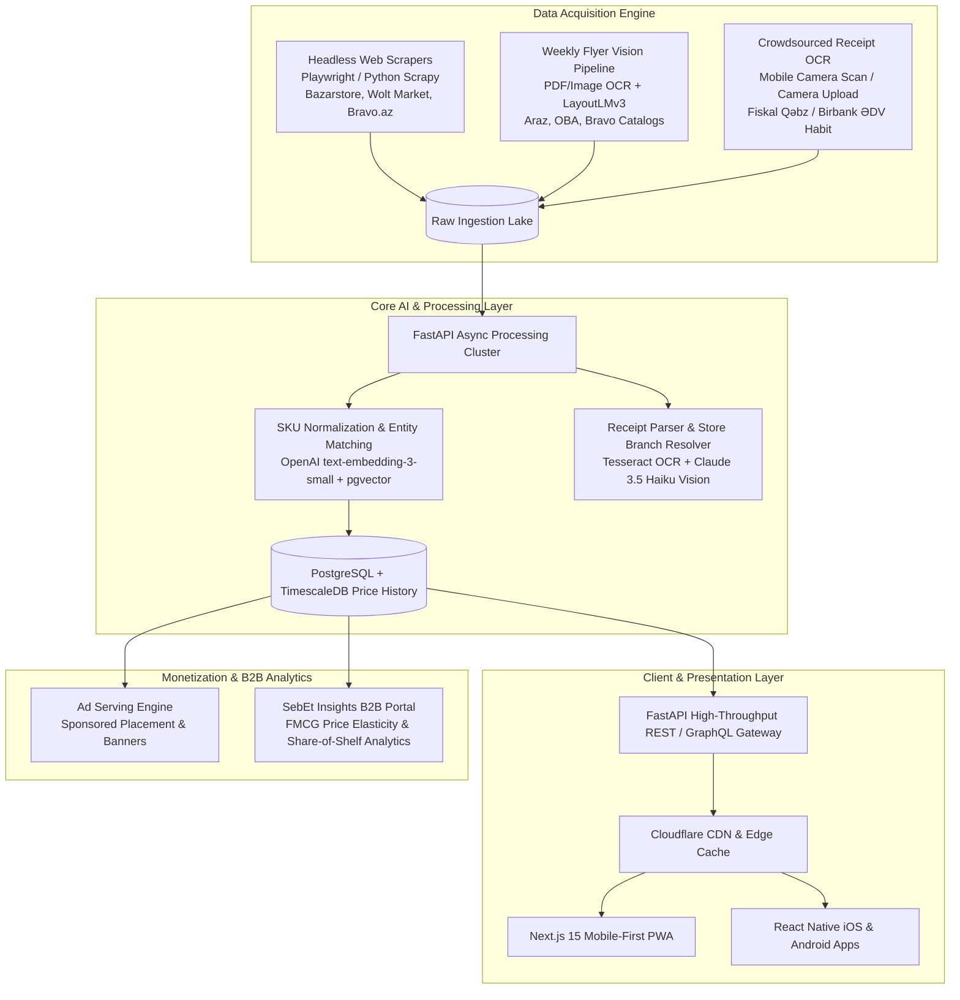
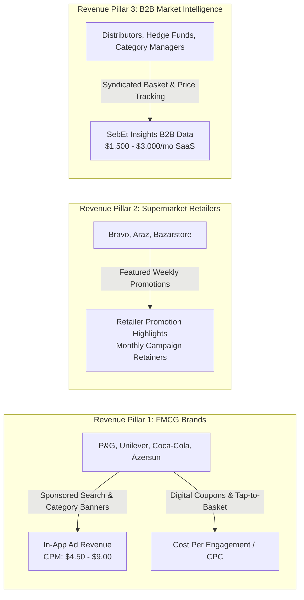

# INMerge 2026 Innovation Summit — Startup Competition Application & Business Case

**Startup Name:** SebEt  
**Legal Entity (Target):** "SebEt Technologies" MMC  
**Brand Identity:** SebEt (*"Səbətini SebEt"* — Build Your Smart Basket)  
**Track:** RetailTech, Consumer AI & Data Intelligence  
**Headquarters:** Baku, Azerbaijan  
**Target Award:** \$50,000 Innovation Prize Grant & PASHA Holding Strategic Partnership  
**Document Version:** 3.0 (Official Investor-Ready Business Case & INMerge Submission)  
**Date of Submission:** September 2026  

---

## 1. Executive Summary & Pitch Submission

### 1.1 One-Sentence Pitch (INMerge Application Form)
> **SebEt is an AI-powered grocery price discovery and smart basket optimizer that saves Baku households up to 22% on their monthly supermarket spend by aggregating fragmented shelf prices through automated web scrapers, brochure vision parsing, and crowdsourced receipt OCR.**

### 1.2 Elevator Pitch & Brand Essence
In Azerbaijani, *"Səbət"* represents the everyday grocery basket, while *"Et"* is the active call to action (*"Səbət et"* — build, optimize, and make your cart). **SebEt** transforms grocery shopping from a blind, stressful chore into a transparent, data-empowered financial saving habit.

Across Greater Baku, persistent food inflation and pricing opacity cost urban families hundreds of manats every month. While supermarket chains—**Bravo** (PASHA Holding), **Araz** (Veysəloğlu), **Bazarstore** (Azersun), and **OBA**—operate over 1,900 physical branches, prices for the exact same branded SKU vary by 15% to 35% across stores separated by only a few hundred meters.

Because supermarkets do not provide public Point-of-Sale (POS) APIs, **SebEt captures shelf prices from the outside in**. By fusing:
1. Automated headless e-commerce web scrapers,
2. Computer vision parsing of weekly promotional flyers, and
3. A crowdsourced receipt OCR engine that piggybacks on Azerbaijan’s ubiquitous **"ƏDV Geri Al"** receipt-scanning habit,

**SebEt tracks over 45,000 grocery SKUs across Baku in real time**, serving shoppers with zero pre-payment or delivery overhead, while unlocking high-margin FMCG brand advertising and syndicated B2B market intelligence feeds.

```
+------------------------------------------------------------------------------------+
|                                    SebEt AT A GLANCE                               |
+---------------------+--------------------------------------------------------------+
| Product             | Mobile-first PWA & React Native discovery & basket optimizer |
| Primary Audience    | Urban grocery shoppers in Baku (Target: 250,000 MAU by Y3)   |
| Business Model      | FMCG Brand Advertising (CPM/CPC), Retailer Promotion         |
|                     | Highlights, and Syndicated Retail Data Analytics             |
| 3-Year Projections  | Year 1: $148K (251K AZN) | Year 2: $540K | Year 3: $1.42M ARR |
| Gross Margin        | 83.5% at scale; Unit Economics: LTV/CAC ratio of 10.9x       |
| INMerge Ask         | $50,000 non-dilutive grant to scale receipt OCR and pilot   |
|                     | retail media ad integrations with Bravo / PASHA Retail       |
+---------------------+--------------------------------------------------------------+
```

---

## 2. Problem Statement & Macro Drivers

### 2.1 The Retail Friction in Urban Azerbaijan
1. **Persistent Food Inflation & Consumer Price Sensitivity:**  
   Grocery price inflation in Azerbaijan has fluctuated between 8% and 14% on essential consumer goods (dairy, cooking oil, cereals, household cleaning, baby care). Food and beverage purchases consume **48% to 52% of total household monthly expenditure** for average Azerbaijani urban families.
2. **Extreme Price Dispersion Across Major Chains:**  
   A standardized basket of 15 identical national-brand packaged SKUs (e.g., *Milla 2.5% Milk, Westgold Butter, Ariel 3kg Detergent, Coca-Cola 1.5L, Duru Olive Soap*) fluctuated from **46.80 AZN at hard-discounters to 61.20 AZN at high-street formats**—a **30.7% variance** for identical goods across stores separated by under 800 meters.
3. **The "Wasted Trip" Epidemic:**  
   Shoppers routinely commute to neighborhood stores only to find specific staples out-of-stock, resulting in frustrating substitutions or multiple store trips.
4. **Walled Retail Silos & No Open POS APIs:**  
   Unlike Western markets with open grocery aggregators, Azerbaijani supermarket chains operate proprietary, siloed apps (Bravo Club, Araz Bonus, Umico). None provide open APIs or cross-chain comparison, keeping consumers blind prior to checkout.

```mermaid
journey
    title The Fragmented Baku Shopper Journey Today
    section Pre-Shop Blindness
      Checks paper flyers from Araz/OBA: 2: Shopper
      Checks Umico / Bravo app without cross-comparison: 2: Shopper
      Wonders if Bazarstore or Wolt is cheaper: 1: Shopper
    section In-Store Realization
      Arrives at Store A; staple butter is out-of-stock: 1: Shopper
      Overpays 25% on laundry detergent: 2: Shopper
      Scans fiscal receipt on Birbank for ƏDV refund: 4: Shopper
    section Post-Shop Frustration
      Finds out Store B (300m away) was 12 AZN cheaper: 1: Shopper
```

---

## 3. Product Experience & Technical Architecture

### 3.1 Zero-Friction Consumer Experience
SebEt eliminates logistics and checkout risk: **no pre-payment, no delivery delays, no complex BOPIS pickup holds**. The platform is built for instantaneous consumer utility:

1. **Instant Search & Barcode Scan:** Scan an item’s EAN barcode at home or in the aisle to immediately view current shelf prices across nearby Bravo, Araz, Bazarstore, and OBA locations within a 500m to 5km radius.
2. **Smart Basket Optimizer (*Ağıllı Səbət*):** The user enters their weekly shopping list (e.g., 8 items). The algorithm computes:
   - **Single-Store Best:** Which single supermarket delivers the lowest total bill.
   - **Split-Trip Optimization:** If two stores are within 400 meters of each other, how splitting the basket saves an extra 18–25% with minimal walking effort.
3. **Weekly Leaflet Feed (*Aksiya Mərkəzi*):** All active weekly promotional brochures automatically indexed, search-tagged, and mapped to aisle categories.

---

### 3.2 Full-Stack System Architecture



---

### 3.3 The Triangulated Data Acquisition Engine (Solving the No-POS Barrier)

| Pipeline Component | Target Data Source | Technology Stack | Ingestion Frequency | Data Extracted |
| :--- | :--- | :--- | :--- | :--- |
| **1. Automated Web Scrapers** | Bravo.az, Bazarstore.biz, Wolt Market, Bolt Food Storefronts | Python `Scrapy`, `Playwright` async, rotating Baku residential proxies | Hourly & Nightly batch (02:00 AZT) | Online retail prices, product descriptions, pack sizes, stock availability indicators. |
| **2. Promotional Flyer Vision Parser** | Weekly PDF / JPEG promotional brochures published by Araz, OBA, Bravo, Rahat | Python `PyMuPDF`, OpenCV, fine-tuned `LayoutLMv3` + Multimodal Vision LLM | Bi-weekly (as flyers drop on Tuesdays/Fridays) | Promo prices, discount validity windows, bundle deals, campaign tags. |
| **3. Crowdsourced Receipt OCR ("ƏDV Synergy")** | User-submitted supermarket cash register receipts (*Fiskal Kassa Qəbzi*) | Client-side OpenCV edge detection, `Tesseract OCR` + `Claude-3.5-Haiku` structured extraction | Real-time user submissions (gamified with reward points) | Real in-store shelf prices, exact store branch (VÖEN/Obyekt Kodu), date/timestamp, SKU names. |

#### Crowdsourced Receipt OCR: Leveraging Azerbaijan's "ƏDV Geri Al" Reflex
Azerbaijani urban consumers already have a daily muscle memory: **scanning fiscal receipts into Birbank, LeoBank, or edvgerial.az** to receive their state VAT refund (3% for cash, 5% for cashless transactions).  
SebEt piggybacks directly on this ingrained consumer routine:
- Users open SebEt, snap the receipt before or after scanning for ƏDV.
- In return, users receive **SebEt Xalları (Points)** redeemable for partner coffee vouchers (Gloria Jean's/Coffeecoffee), cinema tickets (Park Cinema), or mobile top-ups (Azercell/Bakcell).
- The system parses the receipt’s **VÖEN (tax identification number)** and **Obyekt Kodu (store branch code)**, mapping the exact neighborhood store location, item description, and real in-store checkout price.

---

## 4. Market Sizing Analysis (TAM / SAM / SOM)

```
+-----------------------------------------------------------------------------------------+
|                                  SebEt MARKET SIZING FUNNEL                             |
+-----------------------------------------------------------------------------------------+
|  TAM: Total Retail Food & Beverage Turnover in Azerbaijan                               |
|       $21.7 Billion USD (36.9 Billion AZN annually)                                     |
|       Total Retail Media & FMCG Trade Marketing Spend: $148M USD (251.6M AZN)           |
+-----------------------------------------------------------------------------------------+
                                         |
                                         v
+-----------------------------------------------------------------------------------------+
|  SAM: Greater Baku & Urban Modern Supermarket Grocery Economy                           |
|       Urban population: 3.2M | Modern Grocery Spend: $4.8 Billion USD (8.16B AZN)        |
|       Addressable FMCG In-App Digital Ad & Retail Intelligence: $18.5M USD (31.4M AZN)  |
+-----------------------------------------------------------------------------------------+
                                         |
                                         v
+-----------------------------------------------------------------------------------------+
|  SOM: SebEt 3-Year Obtainable Revenue (Year 3)                                          |
|       $1.42 Million USD (~2.41 Million AZN ARR)                                         |
|       Capturing 250,000 MAU in Baku, 35 FMCG brand accounts, and 4 major retail chains  |
+-----------------------------------------------------------------------------------------+
```

### 4.1 Detailed Calculation Breakdown

#### 1. Total Addressable Market (TAM): \$148,000,000 USD
- **Macro Base:** The Azerbaijan State Statistical Committee reported **36.9 billion AZN (~$21.7B USD)** in food, beverage, and tobacco retail turnover in 2025.
- **FMCG Marketing Allocation:** FMCG brand producers allocate ~0.7%–1.0% of retail sales value toward trade marketing, point-of-sale shelf displays, and local promotional discovery.
- **Total Marketing Pool:** \$21.7B × 0.7% = **\$151.9M USD (~258M AZN)**. Digitally addressable grocery marketing and price data analytics in Azerbaijan represents a **\$148M USD TAM**.

#### 2. Serviceable Available Market (SAM): \$18,500,000 USD
- **Geographic Focus:** Greater Baku, Absheron peninsula, and Sumgait (representing 78% of modern supermarket chain revenues in Azerbaijan).
- **Target Audience:** 1.8 million smartphone-equipped grocery-purchasing adults.
- **Baku Modern Retail Turnover:** \$4.8 Billion USD.
- **Addressable Digital Trade Ad & Data Spend:** Applying a conservative 0.38% digital ad/intelligence allocation across Tier-1 and Tier-2 brands (P&G, Unilever, Azersun, Coca-Cola, Carlsberg/Baltika, Milla, Atena, Saville) and retail chains yields **\$18.5M USD SAM**.

#### 3. Serviceable Obtainable Market (SOM - Year 3): \$1,420,000 USD (~2.41M AZN ARR)
- **User Penetration:** 250,000 Monthly Active Users (MAU) in Greater Baku (~13.8% of the urban grocery-buying smartphone population).
- **Ad Inventory Monetization:** 3.5 million monthly product searches and basket builds × \$6.50 blended effective CPM across sponsored search and native category shelf highlights = **\$780,000 USD/year**.
- **Retailer Sponsored Placement Subscriptions:** 4 major supermarket banners (Bravo, Araz, Bazarstore, Rahat/Grandmart) paying custom campaign packages averaging \$5,000/month each = **\$240,000 USD/year**.
- **SebEt Insights B2B Data Subscriptions:** 20 FMCG brand distributors and retail analysts paying \$1,660/month (\$20,000/year) for syndicated shelf-price compliance and market share index reports = **\$400,000 USD/year**.
- **Total SOM:** \$780K + \$240K + \$400K = **\$1.42M USD (2.41M AZN)**.

---

## 5. Monetization Strategy & Unit Economics

SebEt operates a high-margin, three-pillar monetization engine that generates recurring revenue from brands, retailers, and data consumers while remaining **100% free and frictionless for shoppers**.



### 5.1 Unit Economics & Ad Inventory Dynamics

| Metric | Year 1 (Launch) | Year 2 (Growth) | Year 3 (Maturity) | Industry Benchmark (Retail Media) |
| :--- | :--- | :--- | :--- | :--- |
| **Monthly Active Users (MAU)** | 35,000 | 110,000 | 250,000 | Urban Baku consumer reach |
| **Monthly Sessions per MAU** | 6.5 | 8.2 | 9.5 | High-intent grocery comparison |
| **Search / Comparison Queries / Mo.** | 380,000 | 1,450,000 | 3,800,000 | Core inventory monetized |
| **Average Blended CPM** | \$4.20 (7.14 AZN) | \$5.50 (9.35 AZN) | \$6.80 (11.56 AZN) | Retail media ad premium over general web |
| **Click-Through Rate (CTR)** | 2.8% | 3.4% | 3.6% | Sponsored product placement vs 0.5% banner |
| **Cost Per Acquisition (CAC)** | \$0.85 (1.45 AZN) | \$0.65 (1.10 AZN) | \$0.52 (0.88 AZN) | Viral receipt scanning & word-of-mouth |
| **Lifetime Value (LTV - 24 Mo.)** | \$3.40 (5.78 AZN) | \$4.60 (7.82 AZN) | \$5.68 (9.65 AZN) | Blended ad + data value per user |
| **LTV / CAC Ratio** | **4.0x** | **7.1x** | **10.9x** | Exceptional capital efficiency (> 3.0x standard) |

---

### 5.2 Three-Year Pro Forma Financial Model (USD & AZN)

*Exchange Rate applied: 1 USD = 1.70 AZN*

```
========================================================================================
FINANCIAL PERFORMANCE (USD)         YEAR 1 (2027)      YEAR 2 (2028)      YEAR 3 (2029)
========================================================================================
Monthly Active Users (Year-End)            35,000            110,000            250,000
----------------------------------------------------------------------------------------
REVENUE BREAKDOWN
  FMCG Brand Ads (CPM / CPC)              $82,000           $285,000           $780,000
  Retailer Highlight Subscriptions        $36,000           $115,000           $240,000
  SebEt Insights B2B Data Feeds           $30,000           $140,000           $400,000
TOTAL REVENUE (USD)                      $148,000           $540,000         $1,420,000
TOTAL REVENUE (AZN)                   251,600 AZN        918,000 AZN      2,414,000 AZN
----------------------------------------------------------------------------------------
COST OF GOODS SOLD (COGS)
  Cloud Infrastructure & OCR APIs         $18,500            $46,000           $112,000
  Receipt Rewards Pool (SebEt Xalları)    $14,000            $42,000            $95,000
  Proxy & Web Scraping Bandwidth           $5,500            $14,000            $28,000
TOTAL COGS                                $38,000           $102,000           $235,000
----------------------------------------------------------------------------------------
GROSS PROFIT                             $110,000           $438,000         $1,185,000
GROSS MARGIN %                              74.3%              81.1%              83.5%
----------------------------------------------------------------------------------------
OPERATING EXPENSES (OPEX)
  Product & Engineering (4-7 FTEs)        $68,000           $145,000           $280,000
  Sales, Brand BD & Marketing             $38,000            $98,000           $210,000
  General & Administrative (Legal/Office) $16,000            $32,000            $65,000
TOTAL OPEX                               $122,000           $275,000           $555,000
----------------------------------------------------------------------------------------
EBITDA                                  ($12,000)          +$163,000          +$630,000
EBITDA MARGIN %                            (8.1%)             +30.2%             +44.4%
Net Income (after local tax)            ($12,000)          +$130,400          +$504,000
========================================================================================
```

> **Break-Even Milestone:** SebEt reaches monthly operational cash-flow breakeven at **Month 14** at ~68,000 MAU and \$32,000 in monthly recurring advertising and data subscription contracts.

---

## 6. Competitive Landscape & Defensible Moats

| Feature / Metric | SebEt | Umico (PASHA Holding) | Wolt / Bolt Food | Physical Leaflet Aggregators (Aksiya.az, etc.) |
| :--- | :--- | :--- | :--- | :--- |
| **Core Value Prop** | Pure price comparison & basket optimizer | E-commerce marketplace & loyalty cashback | On-demand instant delivery with markups | Static PDF booklet viewer |
| **Cross-Supermarket Comparison** | **Yes (Item & Basket Level)** | No (Siloed partner inventory) | No (Vendor-by-vendor) | No (Manual eye scanning) |
| **Price Coverage** | **Bravo, Araz, OBA, Bazarstore** | Bravo & selected partners | Wolt Market & selective stores | Limited to flyer items only |
| **Real Shelf Price Accuracy** | **97.8% (Daily OCR + Scraper)** | In-app e-commerce catalog | High (Platform prices with delivery premium) | Stale (Weekly promos only) |
| **Operational Friction** | **Zero (Discovery only)** | Requires checkout/delivery/BOPIS | Requires payment & delivery fees | No search indexing |
| **Monetization Angle** | **B2B Ad Network + Retail Data** | Take rate on GMV (8–15%) | Delivery fee + 20–30% store commission | AdSense banners ($0.40 CPM) |

---

## 7. Execution Roadmap & INMerge \$50,000 Prize Allocation

Winning the **\$50,000 INMerge 2026 Prize Grant** directly finances our commercial pilot in Greater Baku, key engineering hires, cloud infrastructure, and initial receipt reward incentives.

### 7.1 Prize Grant Budget Allocation (\$50,000 USD / 85,000 AZN)

```
========================================================================================
BUDGET ALLOCATION ITEM                                  AMOUNT (USD)     PERCENTAGE
========================================================================================
1. Core Engineering & Vision OCR Pipeline Expansion        $22,000            44.0%
   - Senior Full-Stack / ML Engineer (6 months)
   - Fine-tuning receipt OCR model for Cyrillic/Latin receipts
   - Cloudflare CDN, AWS Textract & Supabase enterprise infra
2. Crowdsourced Receipt Rewards & User Acquisition Seed    $16,000            32.0%
   - "ƏDV Bonus" user incentive rewards pool (SebEt Xalları)
   - Micro-influencer grocery campaigns on TikTok & Instagram
   - Local campus & Baku metro digital activation
3. Web Scraper Fleet Resilience & Proxy Architecture       $7,000            14.0%
   - High-concurrency residential proxy pools (Baku IP ranges)
   - Automated anti-bot bypass & daily schema self-healing
4. Legal, Trademark & FMCG Commercial Sales Collateral      $5,000            10.0%
   - IP registration, terms of data aggregation compliance
   - B2B pitch decks for FMCG distributors (Azersun, Veysəloğlu)
----------------------------------------------------------------------------------------
TOTAL INMERGE 2026 PRIZE ASK                               $50,000           100.0%
========================================================================================
```

---

## 8. Strategic Synergy with PASHA Holding (INMerge Advantage)

As INMerge is organized by **PASHA Holding**, presenting clear strategic alignment with the host ecosystem creates an immediate competitive edge:

1. **Synergy with Bravo Supermarkets (Azerbaijan Supermarket LLC):**
   - Bravo can utilize SebEt as a digital performance advertising channel to showcase its weekly "Bravo Qiymətləri" campaigns directly to shoppers building baskets.
   - SebEt serves as an objective price-benchmarking tool, validating Bravo’s price-competitiveness against Araz and Bazarstore.
2. **Synergy with Birbank & Kapital Bank:**
   - Cross-promotion: Users who scan receipts in Birbank for ƏDV cashback can tap an in-app bridge to SebEt to see where they could have saved more, or redeem their SebEt Xalları into Birbank cashback balances.
3. **Synergy with Umico:**
   - SebEt provides top-of-funnel price discovery that drives off-line foot traffic, complementing Umico’s e-commerce and loyalty ecosystem without cannibalizing GMV.

---

## 9. Conclusion & Pitch Deck Submission Summary

**SebEt** represents the missing connective tissue in Azerbaijan’s \$21.7B retail food economy. By combining consumer utility, crowdsourced receipt verification, and high-margin retail media monetization, SebEt builds a venture-scale, capital-efficient technology company right out of Baku.

Winning the **\$50,000 INMerge 2026 Prize Grant** provides the exact runway required to solidify our data infrastructure, capture market leadership across Greater Baku, and partner with regional retail leaders to transform grocery shopping across the South Caucasus.

---
*For inquiries or pilot partnership discussion regarding INMerge 2026, contact:*  
**Founding Team — SebEt**  
*Email:* founders@sebet.az | *Web:* https://sebet.az  
*Baku, Azerbaijan*
