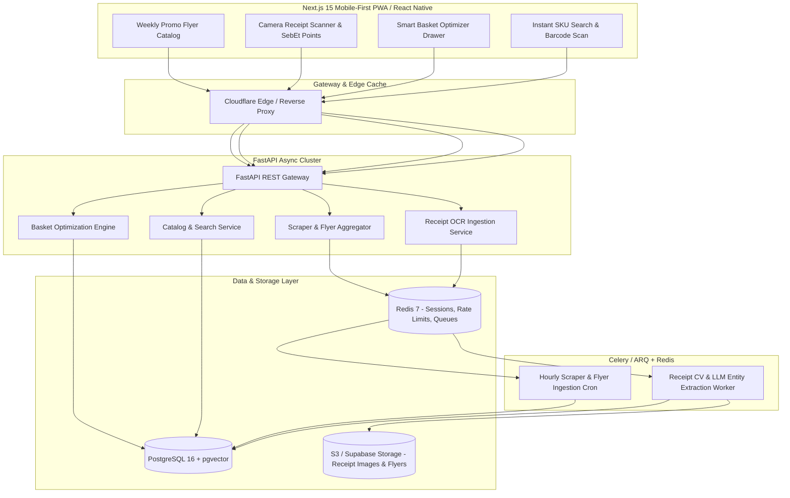

# SebEt — Complete Technical Blueprint & MVP Implementation Specification

This document provides the exhaustive, end-to-end technical specification, database models, OCR algorithms, API routes, and directory structure required to build the **SebEt** MVP (*Consumer Grocery Price Intelligence & Local Shelf-Stock Tracker in Baku, Azerbaijan*) from scratch in Antigravity.

---

## 1. System Architecture Overview



### Core Technology Stack Choices
- **Frontend:** Next.js 15 (App Router), React 19, TypeScript, Tailwind CSS, Shadcn UI, Lucide Icons, HTML5 Barcode/Camera API (`@zxing/browser` or BarcodeDetector API), Zustand for client-side state.
- **Backend:** FastAPI (Python 3.12, async), Pydantic v2, SQLAlchemy 2.0 (asyncpg driver), Alembic for migrations.
- **Database:** PostgreSQL 16 with `pgvector` extension (for semantic SKU matching and product clustering).
- **Background Tasks & Caching:** Redis 7 + ARQ or Celery for non-blocking receipt OCR and automated scraper workers.
- **Computer Vision & OCR:**
  - Image Preprocessing: OpenCV (`cv2`) for grayscale, adaptive thresholding, and perspective deskewing.
  - OCR Engine: Dual pipeline (Tesseract OCR / EasyOCR + Claude 3.5 Haiku / GPT-4o-mini structured JSON extraction).
- **Web Scraping:** Playwright Python (headless browser with stealth flags) + Scrapy with rotating residential proxies.

---

## 2. Complete Database Schema (PostgreSQL)

```sql
-- Enable UUID and Vector extensions
CREATE EXTENSION IF NOT EXISTS "uuid-ossp";
CREATE EXTENSION IF NOT EXISTS "vector";

-- 1. Retailer Chains (Bravo, Araz, Bazarstore, OBA)
CREATE TABLE chains (
    id UUID PRIMARY KEY DEFAULT uuid_generate_v4(),
    name VARCHAR(100) NOT NULL UNIQUE, -- e.g., 'Bravo', 'Araz', 'OBA', 'Bazarstore'
    slug VARCHAR(100) NOT NULL UNIQUE,
    logo_url TEXT,
    is_active BOOLEAN DEFAULT TRUE,
    created_at TIMESTAMP WITH TIME ZONE DEFAULT NOW()
);

-- 2. Physical Store Branches in Greater Baku
CREATE TABLE stores (
    id UUID PRIMARY KEY DEFAULT uuid_generate_v4(),
    chain_id UUID NOT NULL REFERENCES chains(id) ON DELETE CASCADE,
    branch_name VARCHAR(255) NOT NULL, -- e.g., 'Bravo 28 Mall', 'Araz Nərimanov'
    voen VARCHAR(50),                  -- Tax ID from receipt (e.g., '1401564751')
    obyekt_kodu VARCHAR(50),           -- Store branch code on fiscal receipt
    address TEXT NOT NULL,
    latitude DECIMAL(10, 8) NOT NULL,
    longitude DECIMAL(11, 8) NOT NULL,
    is_active BOOLEAN DEFAULT TRUE,
    created_at TIMESTAMP WITH TIME ZONE DEFAULT NOW()
);
CREATE INDEX idx_stores_lat_lon ON stores(latitude, longitude);
CREATE INDEX idx_stores_voen_obyekt ON stores(voen, obyekt_kodu);

-- 3. Product Categories
CREATE TABLE categories (
    id UUID PRIMARY KEY DEFAULT uuid_generate_v4(),
    parent_id UUID REFERENCES categories(id) ON DELETE SET NULL,
    name_az VARCHAR(150) NOT NULL,
    name_en VARCHAR(150),
    slug VARCHAR(150) NOT NULL UNIQUE,
    icon_name VARCHAR(100)
);

-- 4. Canonical Products (Master SKU Catalog)
CREATE TABLE products (
    id UUID PRIMARY KEY DEFAULT uuid_generate_v4(),
    barcode VARCHAR(64) UNIQUE, -- EAN-13 barcode
    canonical_name VARCHAR(255) NOT NULL, -- e.g., 'Süd Milla 2.5% 1L'
    brand VARCHAR(100),                   -- e.g., 'Milla', 'Westgold', 'Ariel'
    category_id UUID REFERENCES categories(id) ON DELETE SET NULL,
    unit VARCHAR(20) DEFAULT 'piece',     -- 'piece', 'kg', 'liter', 'gram'
    pack_size VARCHAR(50),                -- '1L', '3kg', '200g'
    image_url TEXT,
    embedding vector(384),                -- Sentence-transformers embedding for fuzzy matching
    created_at TIMESTAMP WITH TIME ZONE DEFAULT NOW()
);
CREATE INDEX idx_products_barcode ON products(barcode);
CREATE INDEX idx_products_canonical_name ON products(canonical_name);

-- 5. Real-Time Store Prices (Aggregated from Scrapers, OCR & Flyers)
CREATE TABLE store_prices (
    id UUID PRIMARY KEY DEFAULT uuid_generate_v4(),
    product_id UUID NOT NULL REFERENCES products(id) ON DELETE CASCADE,
    store_id UUID NOT NULL REFERENCES stores(id) ON DELETE CASCADE,
    price DECIMAL(10, 2) NOT NULL,        -- Normal shelf price in AZN
    promo_price DECIMAL(10, 2),          -- Discounted price in AZN if on promotion
    is_promo BOOLEAN DEFAULT FALSE,
    in_stock BOOLEAN DEFAULT TRUE,
    source_type VARCHAR(30) NOT NULL,    -- 'web_scraper', 'receipt_ocr', 'weekly_flyer'
    confidence_score DECIMAL(3, 2) DEFAULT 1.00,
    recorded_at TIMESTAMP WITH TIME ZONE DEFAULT NOW(),
    expires_at TIMESTAMP WITH TIME ZONE, -- For weekly flyer validity
    CONSTRAINT uq_product_store_recorded UNIQUE(product_id, store_id, recorded_at)
);
CREATE INDEX idx_store_prices_lookup ON store_prices(product_id, store_id, recorded_at DESC);

-- 6. Crowdsourced Receipts
CREATE TABLE receipts (
    id UUID PRIMARY KEY DEFAULT uuid_generate_v4(),
    user_id UUID,                        -- Optional for guest scans, or references users table
    image_url TEXT NOT NULL,
    fiscal_id VARCHAR(100),              -- NÖŞ or Fiscal ID (Deduplication key)
    voen VARCHAR(50),
    obyekt_kodu VARCHAR(50),
    matched_store_id UUID REFERENCES stores(id) ON DELETE SET NULL,
    receipt_date TIMESTAMP WITH TIME ZONE,
    total_amount DECIMAL(10, 2),
    raw_ocr_text TEXT,
    processing_status VARCHAR(30) DEFAULT 'PENDING', -- 'PENDING', 'PROCESSED', 'FAILED', 'DUPLICATE'
    sebet_points_awarded INT DEFAULT 0,
    created_at TIMESTAMP WITH TIME ZONE DEFAULT NOW()
);
CREATE UNIQUE INDEX idx_receipts_fiscal_id ON receipts(fiscal_id) WHERE fiscal_id IS NOT NULL;

-- 7. Line Items from Receipts
CREATE TABLE receipt_items (
    id UUID PRIMARY KEY DEFAULT uuid_generate_v4(),
    receipt_id UUID NOT NULL REFERENCES receipts(id) ON DELETE CASCADE,
    raw_line_text VARCHAR(255) NOT NULL, -- e.g., 'MILLA SUD 2.5% 1L TETRA'
    matched_product_id UUID REFERENCES products(id) ON DELETE SET NULL,
    quantity DECIMAL(8, 2) DEFAULT 1.00,
    unit_price DECIMAL(10, 2) NOT NULL,
    total_price DECIMAL(10, 2) NOT NULL,
    confidence_score DECIMAL(3, 2)
);

-- 8. Users & Rewards
CREATE TABLE users (
    id UUID PRIMARY KEY DEFAULT uuid_generate_v4(),
    phone_number VARCHAR(20) UNIQUE NOT NULL,
    full_name VARCHAR(100),
    sebet_points INT DEFAULT 0,
    created_at TIMESTAMP WITH TIME ZONE DEFAULT NOW()
);
```

---

## 3. Azerbaijani Receipt OCR & Entity Matching Engine

### 3.1 Azerbaijani Fiscal Receipt Structure (*Fiskal Kassa Qəbzi*)
An Azerbaijani supermarket receipt conforms to the State Tax Service format:
- **Header:** Supermarket legal name, VÖEN (e.g., `1401564751` for Azerbaijan Supermarket LLC / Bravo), Obyekt Kodu (store branch ID), Address.
- **Body:** Numbered rows containing:
  `[Item Name] x [Quantity] = [Line Price] AZN`
- **Footer:** Total amount (`YEKUN / CƏMİ: XX.XX AZN`), Fiscal Sign / NÖŞ (`NÖŞ: 0000000000000000`), QR Code containing fiscal verification URL (`https://monitoring.e-kassa.gov.az/...`).

### 3.2 Processing Pipeline Code (`backend/app/services/ocr_service.py`)

```python
import re
import cv2
import numpy as np
from typing import Dict, Any, List
from pydantic import BaseModel

class ParsedLineItem(BaseModel):
    raw_name: str
    quantity: float
    unit_price: float
    total_price: float

class ParsedReceipt(BaseModel):
    voen: str | None
    obyekt_kodu: str | None
    fiscal_id: str | None
    total_amount: float | None
    items: List[ParsedLineItem]

class AzerbaijaniReceiptParser:
    def preprocess_image(self, image_bytes: bytes) -> np.ndarray:
        """Converts image to optimal grayscale with adaptive thresholding."""
        nparr = np.frombuffer(image_bytes, np.uint8)
        img = cv2.imdecode(nparr, cv2.IMREAD_COLOR)
        gray = cv2.cvtColor(img, cv2.COLOR_BGR2GRAY)
        clahe = cv2.createCLAHE(clipLimit=2.0, tileGridSize=(8, 8))
        contrast = clahe.apply(gray)
        denoised = cv2.fastNlMeansDenoising(contrast, None, 10, 7, 21)
        return denoised

    def extract_fiscal_metadata(self, text: str) -> Dict[str, Any]:
        """Extracts VÖEN, Obyekt Kodu, NÖŞ (Fiscal ID), and Total."""
        voen_match = re.search(r"V[ÖO]EN\s*[:\s]?\s*(\d{10})", text, re.IGNORECASE)
        obyekt_match = re.search(r"OBYEKT\s*KODU\s*[:\s]?\s*(\d+)", text, re.IGNORECASE)
        fiscal_match = re.search(r"(?:NÖŞ|NOS|F[İI]SKAL\s*ID)\s*[:\s]?\s*([A-Za-z0-9]{12,20})", text, re.IGNORECASE)
        total_match = re.search(r"(?:YEKUN|C[ƏE]M[İI]|TOTAL)\s*[:\s]?\s*(\d+[.,]\d{2})", text, re.IGNORECASE)
        
        return {
            "voen": voen_match.group(1) if voen_match else None,
            "obyekt_kodu": obyekt_match.group(1) if obyekt_match else None,
            "fiscal_id": fiscal_match.group(1) if fiscal_match else None,
            "total_amount": float(total_match.group(1).replace(",", ".")) if total_match else None
        }

    def parse_line_items(self, lines: List[str]) -> List[ParsedLineItem]:
        """Parses individual items using regex and quantity x price pattern."""
        items = []
        item_pattern = re.compile(r"^(.+?)\s+(\d+(?:[.,]\d+)?)\s*(?:[xX*])\s*(\d+(?:[.,]\d{2}))\s*=?\s*(\d+(?:[.,]\d{2}))?")
        
        for line in lines:
            line_clean = line.strip()
            match = item_pattern.search(line_clean)
            if match:
                name, qty, unit_price, total_price = match.groups()
                qty_f = float(qty.replace(",", "."))
                unit_f = float(unit_price.replace(",", "."))
                total_f = float(total_price.replace(",", ".")) if total_price else round(qty_f * unit_f, 2)
                items.append(ParsedLineItem(
                    raw_name=name.strip(),
                    quantity=qty_f,
                    unit_price=unit_f,
                    total_price=total_f
                ))
        return items
```

---

## 4. Smart Basket Optimizer Algorithm ("Ağıllı Səbət")

Given a user's grocery basket:
$$\mathcal{B} = \{(p_1, q_1), (p_2, q_2), \dots, (p_n, q_n)\}$$
and a geographical search radius $R \le 3\text{ km}$ around $(lat_u, lon_u)$:

### Mathematical Objective
1. **Single-Store Minimum Cost ($S_{best}$):**
   Find store $s \in \mathcal{S}_{nearby}$ that minimizes:
   $$\text{Cost}(s) = \sum_{i=1}^n q_i \times \text{Price}(p_i, s)$$
   subject to the in-stock constraint:
   $$\text{Coverage}(s) = \frac{|\{p_i \in \mathcal{B} \mid \text{Price}(p_i, s) > 0\}|}{n} \ge 80\%$$

2. **Dual-Store Split Optimization ($s_1, s_2$):**
   Find pair $(s_1, s_2)$ such that $\text{Distance}(s_1, s_2) \le 600\text{ meters}$, minimizing:
   $$\text{Cost}(s_1, s_2) = \sum_{i=1}^n q_i \times \min\Big(\text{Price}(p_i, s_1), \text{Price}(p_i, s_2)\Big)$$
   Return the net saving in AZN and percentage:
   $$\Delta_{\text{savings}} = \text{Cost}(S_{best}) - \text{Cost}(s_1, s_2)$$

### Optimization Engine Code (`backend/app/services/basket_optimizer.py`)

```python
from typing import List, Dict, Any
from geopy.distance import geodesic

class BasketOptimizer:
    @staticmethod
    def optimize(
        basket_items: List[Dict[str, Any]],
        stores_inventory: List[Dict[str, Any]],
        user_coords: tuple[float, float],
        max_walking_distance_m: float = 600.0
    ) -> Dict[str, Any]:
        single_store_results = []
        for store in stores_inventory:
            store_id = store["store_id"]
            total_cost = 0.0
            available_items = 0
            item_breakdown = []

            for b_item in basket_items:
                pid = b_item["product_id"]
                qty = b_item["quantity"]
                price = store["prices"].get(pid)
                if price:
                    item_cost = price * qty
                    total_cost += item_cost
                    available_items += 1
                    item_breakdown.append({"product_id": pid, "unit_price": price, "total": item_cost})

            coverage = available_items / len(basket_items)
            if coverage >= 0.75:
                single_store_results.append({
                    "store_id": store_id,
                    "store_name": store["branch_name"],
                    "chain_name": store["chain_name"],
                    "total_cost": round(total_cost, 2),
                    "coverage_pct": round(coverage * 100, 1),
                    "distance_km": round(geodesic(user_coords, (store["lat"], store["lon"])).km, 2),
                    "items": item_breakdown
                })

        single_store_results.sort(key=lambda x: x["total_cost"])
        best_single = single_store_results[0] if single_store_results else None

        best_split = None
        min_split_cost = float("inf")

        for i, s1 in enumerate(stores_inventory):
            for s2 in stores_inventory[i+1:]:
                store_dist = geodesic((s1["lat"], s1["lon"]), (s2["lat"], s2["lon"])).meters
                if store_dist > max_walking_distance_m:
                    continue

                split_cost = 0.0
                split_items_s1 = []
                split_items_s2 = []
                fully_covered = True

                for b_item in basket_items:
                    pid = b_item["product_id"]
                    qty = b_item["quantity"]
                    p1 = s1["prices"].get(pid, float("inf"))
                    p2 = s2["prices"].get(pid, float("inf"))

                    if p1 == float("inf") and p2 == float("inf"):
                        fully_covered = False
                        break

                    if p1 <= p2:
                        split_cost += p1 * qty
                        split_items_s1.append(pid)
                    else:
                        split_cost += p2 * qty
                        split_items_s2.append(pid)

                if fully_covered and split_cost < min_split_cost:
                    min_split_cost = split_cost
                    best_split = {
                        "store_1": {"id": s1["store_id"], "name": s1["branch_name"], "items_count": len(split_items_s1)},
                        "store_2": {"id": s2["store_id"], "name": s2["branch_name"], "items_count": len(split_items_s2)},
                        "total_cost": round(split_cost, 2),
                        "distance_between_stores_m": round(store_dist, 0),
                        "savings_vs_single_azn": round(best_single["total_cost"] - split_cost, 2) if best_single else 0.0
                    }

        return {
            "best_single_store": best_single,
            "best_split_store": best_split,
            "all_single_stores": single_store_results[:5]
        }
```

---

## 5. Core API Endpoints (FastAPI Specification)

```
========================================================================================
METHOD  ENDPOINT                            DESCRIPTION
========================================================================================
GET     /api/v1/products/search             Fuzzy search products by name or barcode
GET     /api/v1/products/{barcode}          Retrieve single SKU details & prices across stores
GET     /api/v1/categories                  Category tree hierarchy with icons
POST    /api/v1/basket/optimize             Compute single & dual store lowest prices
POST    /api/v1/receipts/upload             Upload camera receipt image (Multipart Form)
GET     /api/v1/receipts/{receipt_id}       Check OCR status, extracted lines & SebEt Points
GET     /api/v1/flyers/active               Retrieve active weekly promotional catalogs
GET     /api/v1/stores/nearby               Locate supermarkets within X km radius
POST    /api/v1/users/auth                  SMS OTP authentication (mock/Twilio)
GET     /api/v1/users/me/points             Retrieve user balance of SebEt Points
========================================================================================
```

---

## 6. Monorepo Directory Structure

```
sebet/
├── docker-compose.yml              # PostgreSQL (with pgvector), Redis, API, Worker
├── .env.example
├── README.md
├── backend/                        # FastAPI Application
│   ├── Dockerfile
│   ├── requirements.txt
│   ├── app/
│   │   ├── main.py                 # FastAPI app entry point & CORS
│   │   ├── core/
│   │   │   ├── config.py           # Environment settings (Pydantic v2)
│   │   │   └── database.py         # Async SQLAlchemy session engine
│   │   ├── models/                 # SQLAlchemy ORM Models
│   │   │   ├── chain.py
│   │   │   ├── store.py
│   │   │   ├── product.py
│   │   │   ├── price.py
│   │   │   └── receipt.py
│   │   ├── schemas/                # Pydantic validation schemas
│   │   │   ├── product.py
│   │   │   ├── basket.py
│   │   │   └── receipt.py
│   │   ├── api/v1/                 # Router controllers
│   │   │   ├── products.py
│   │   │   ├── basket.py
│   │   │   ├── receipts.py
│   │   │   └── flyers.py
│   │   ├── services/               # Core business logic
│   │   │   ├── ocr_service.py      # OpenCV + Tesseract / Vision parser
│   │   │   ├── basket_optimizer.py # Optimization algorithm
│   │   │   └── scraper_service.py  # Playwright scrapers
│   │   └── workers/                # Background worker definitions
│   │       └── tasks.py            # Celery / ARQ background tasks
│   └── scripts/
│       └── seed_baku_data.py       # Populates 200+ real Baku SKUs across Bravo, Araz, OBA
└── frontend/                       # Next.js 15 PWA
    ├── Dockerfile
    ├── package.json
    ├── tailwind.config.ts
    ├── next.config.ts
    ├── src/
    │   ├── app/
    │   │   ├── layout.tsx          # Root layout & Navigation shell
    │   │   ├── page.tsx            # Home: Search, Barcode Scan & Top Deals
    │   │   ├── basket/
    │   │   │   └── page.tsx        # Smart Basket Optimizer view
    │   │   ├── scan/
    │   │   │   └── page.tsx        # Receipt upload & live camera capture
    │   │   ├── flyers/
    │   │   │   └── page.tsx        # Weekly catalog leaf-through
    │   │   └── profile/
    │   │       └── page.tsx        # User SebEt Points & scanned receipt history
    │   ├── components/
    │   │   ├── BarcodeScanner.tsx   # Native / ZXing barcode detector modal
    │   │   ├── ProductCard.tsx      # Price comparison across Bravo/Araz/OBA badges
    │   │   ├── BasketDrawer.tsx     # Persistent floating cart drawer
    │   │   └── StoreMapModal.tsx    # Leaflet / Mapbox store location preview
    │   └── lib/
    │       ├── api.ts              # Fetch client to FastAPI backend
    │       └── store.ts            # Zustand basket state with localStorage sync
```

---

## 7. Turnkey Kickoff Prompt for a New Antigravity Chat

Copy and paste the exact prompt below into a brand new Antigravity chat to build the working **SebEt** MVP:

```markdown
Role: You are an elite principal full-stack engineer and retail-tech architect.

Objective: Build the complete, functional MVP for "SebEt" (Consumer Grocery Price Intelligence & Local Shelf-Stock Tracker for Baku, Azerbaijan) using Next.js 15, FastAPI, PostgreSQL (with pgvector), and Redis.

Context & Product Vision:
SebEt is a consumer grocery price discovery and smart basket optimizer ("Səbətini SebEt") that compares shelf prices across Baku's top supermarket chains (Bravo, Araz, Bazarstore, and OBA) without requiring POS integrations. It uses crowdsourced receipt OCR ("ƏDV Geri Al" habit), weekly brochure parsing, and web scrapers.

Please execute the following steps in planning mode and then implement the working codebase:

1. Scaffold Monorepo & Infrastructure:
   - Create docker-compose.yml containing PostgreSQL 16 (with pgvector), Redis 7, Backend, and Frontend.
   - Set up backend/ with FastAPI (Python 3.12, asyncpg, SQLAlchemy 2.0, Pydantic v2).
   - Set up frontend/ with Next.js 15 (App Router, Tailwind CSS, Lucide icons, Shadcn UI, Zustand).

2. Implement Database Schema & Seed Data:
   - Create models for chains, stores (with Baku lat/lng and VÖEN/Obyekt kodu), categories, products, store_prices, receipts, and receipt_items.
   - Provide a realistic Baku seed script (scripts/seed_baku_data.py) pre-populating:
     * 4 Major Chains: Bravo, Araz, OBA, Bazarstore.
     * 12 Real Store Branches in Baku (Nizami, Nərimanov, 28 May, Yasamal, Elmlər).
     * 50+ Real Packaged Grocery SKUs (Milla milk, Westgold butter, Ariel detergent, Duru soap, Sirab water, Azerçay, Bizim Süfrə mayonnaise) with accurate price variances across discounters and premium supermarkets.

3. Implement Core Backend Services & APIs:
   - GET /api/v1/products/search: Fuzzy text & category search.
   - GET /api/v1/products/{barcode}: Barcode lookup returning price comparison table across stores.
   - POST /api/v1/basket/optimize: Calculates single-store best total price vs. split-store dual trip within 600m walking radius.
   - POST /api/v1/receipts/upload: Receipt OCR parser with OpenCV preprocessing, regex/Tesseract extraction for VÖEN, Obyekt Kodu, line items, and auto-crediting SebEt Points.
   - GET /api/v1/flyers/active: Lists active weekly promotional discounts from Araz, OBA, and Bravo.

4. Build Mobile-First Next.js Frontend:
   - Modern, sleek mobile-first UI with green/emerald branding ("SebEt").
   - Home screen: Search bar with instant autocomplete, barcode camera scanner trigger, and "Top Discounts Today in Baku" carousel.
   - Smart Basket Optimizer screen: Add items, toggle quantities, and view the comparison card showing "Cheapest Single Store" vs "Save X AZN by splitting between Bravo & OBA".
   - Receipt Scanner screen: Camera view or file upload for fiscal receipt with an instant receipt parsing preview and "+50 SebEt Points" animation.
   - Weekly Leaflet Viewer: Browse digitized discount catalogs from Araz, OBA, and Bravo with "Add to Basket" buttons.

Ensure all code is production-grade, modular, fully typed, and ready to run with `docker compose up --build`.
```
